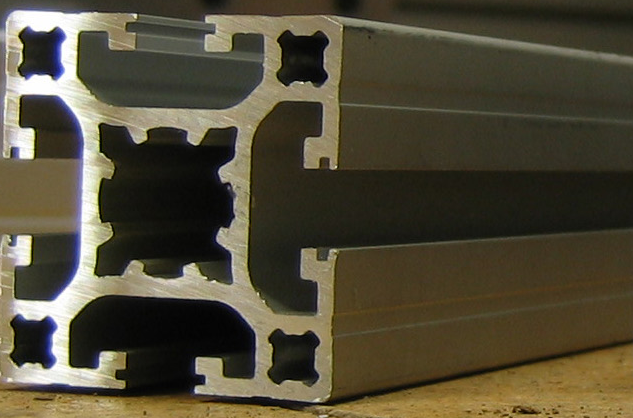
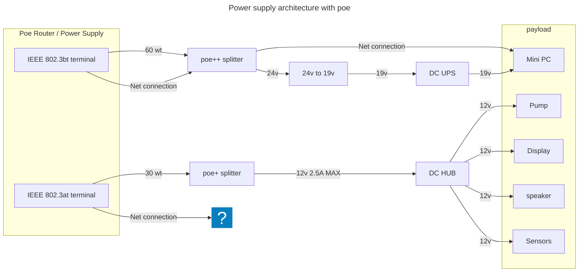
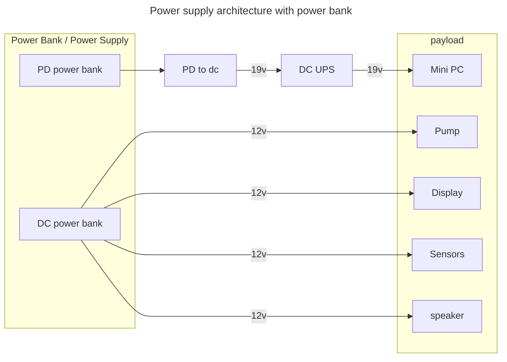

# Table of Contents

1. [Introduction](#introduction)
1. [Installation](#installation)
1. [Dependencies](#dependencies)
1. [Usage](#usage)
1. [Parts List](#parts-list)
1. [Architecture](#architecture)
1. [Contributing](#contributing)
1. [License](#license)

# Introduction

{width=50%}

CageLab is a low cost in-cage touchscreen training device that prioritises the following features:

1. **Customisable**: The device should be customisable to suit different facility needs. We employ a modular design using [ T-slot framing](https://en.wikipedia.org/wiki/T-slot_structural_framing) for the shell to allow for easy modification without needing a full workshop.
1. **Scalable**: Integration with the Alyx metadata pipeline ([International Brain Lab, 2023, Nature Methods](https://doi.org/10.1038/s41592-022-01742-6)) to allow for easy management of the data generated by multiple CageLab instances. Each device uploads behavioural data to a central server, which can be accessed and searched by the user through a web interface.
1. **Automatic Training**: Use behavioural shaping stages with an automated staircase to guide subjects to improved behavioural performance with less experimenter intervention.
1. **Low Cost**: CageLab should be affordable for most research labs. We aim to keep the total cost of the device below $400.
1. **Single-enclosure & Battery Operated**: Many animal facilities do not have accesible power outlets near animal housing, or do not want cables or extra trolleys. The device should be self-contained and battery operated. We added a small UPS to enable hot-swapping of batteries.
1. **Open Source**: The device software should be open source and easy to contribute to.
1. **Common Software Path**: The device should be easy to use and maintain; we use [PsychToolbox (PTB)](https://psychtoolbox.org) for easy integration with existing code common in most labs where PTB is prevalent. PTB offers best-in-class experiment timing and a wide range of specialised hardware support.
1. **Modular**: We have the following modules to use with the device:
   - **Fluid Pump**: Peristaltic pump, HID interface and costs about $10.
   - **Food Dispenser**: A pellet dispenser using an arduino driver.
   - **Camera**: A camera to record the animal's behaviour and stream it over the network.
   - **Speaker**: A speaker to play sounds.
1. **Remote Control**: The device must be controllable remotely. We use the fast moonlight remote desktop protocol and server + client protocols where useful.

# Installation and Setup

## Multi-Cage Setup

CageLab is designed to be used in a multi-cage setup. Each CageLab instance is connected to a central Alyz server that manages the data generated by each device. The server is accessible through a web interface that allows the user to search and download the data generated by each device. The experiment control software is run on a remote desktop that is connected to the device through the ZeroMQ client server protocol. The remote desktop allows the user to control the device from a distance and monitor the animal's behaviour through a camera that is connected to the device.

## Hardware

## Software

You need Octave / MATLAB, PTB and the [opticka toolbox](https://github.com/iandol/opticka) installed as dependencies. For remote desktop, you need to install moonlight on the device and the client.

# Dependencies

- [matmoteGO](https://github.com/Ccccraz/matmoteGO.git)
- [cogmote](https://github.com/Ccccraz/cogmote.git)
- [cogmoteGO](https://github.com/Ccccraz/cogmoteGO.git)
- [streaming](https://github.com/Ccccraz/cagelab_streaming.git) Construction in progress
- [PTBSimia](https://github.com/Ccccraz/PTBSimia.git)

# Parts List

# Architecture

## Power supply architecture

### Poe solution

In previous version, we need to use power bank to power the device, but it is limiting the time of use. So we try to use poe to power the device.

> need poe IEEE 802.3bt and 802.3at protocol

> Expermimental feature!!!

> DC HUB was dangeous!!!

### Power bank solution

# Contributing

Please feel free to open issues or pull requests. We are happy to help you get started with CageLab. We are also looking for collaborators to help us improve the device.

# License
