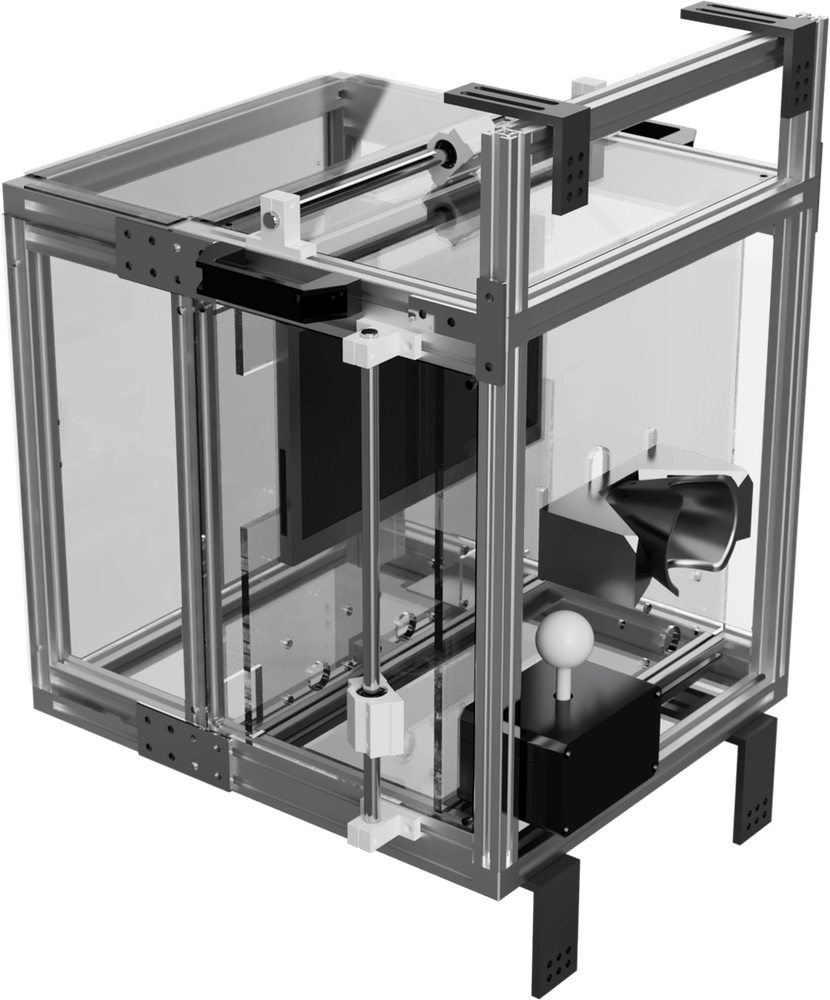

# Table of Contents

1. [Introduction](#introduction)
1. [Installation](#installation)
1. [Usage](#usage)
1. [Parts List](#parts-list)
1. [Contributing](#contributing)
1. [License](#license)

# Introduction

CageLab is a low cost in-cage touchscreen training device that prioritises the following features:

1. **Customisable**: The device should be customisable to suit different facility needs. We employ a modular design using [T-slot framing](https://en.wikipedia.org/wiki/T-slot_structural_framing) <picture src="images/tslot.png"></picture> for the shell to allow for easy modification without needing a full workshop.
1. **Scaleable**: We are integrating the Alyx metadata pipeline ([International Brain Lab, 2023, Nature Methods](https://doi.org/10.1038/s41592-022-01742-6)) to allow for easy management of the data generated by multiple CageLab instances. Each device uploads behavioural data to a central server, which can be accessed and searched by the user through a web interface.
1. **Automatic Training**: We use behavioural shaping and an automated staircase to guide subjects to improved behavioural performance.
1. **Low Cost**: The device should be affordable for most research labs. We aim to keep the total cost of the device below $400.
1. **Battery Operated**: Many animal facilities do not have power outlets in the animal rooms. The device should be battery operated. We use a small UPS to enable hot-swapping of batteries.
1. **Open Source**: The device software should be open source and easy to contribute to.
1. **Easy to Use**: The device should be easy to use and maintain; we chose PsychToolbox for easy integration with existing code common in most labs where PTB is dominant.
1. **Modular**: We have the following modules to use with the device:
	i. **Fluid Pump**: Peristaltic pump, HID interface and costs about $10.
	i. **Food Dispenser**: A pellet dispenser.
	i. **Camera**: A camera to record the animal's behaviour and stream it over the network.
	i. **Speaker**: A speaker to play sounds.
1. **Remote Control**: The device should be controllable remotely.

# Installation

# Usage

## Hardware

## Software

# Parts List

# Contributing

Please feel free to open issues or pull requests. We are happy to help you get started with CageLab. We are also looking for collaborators to help us improve the device.

# License

