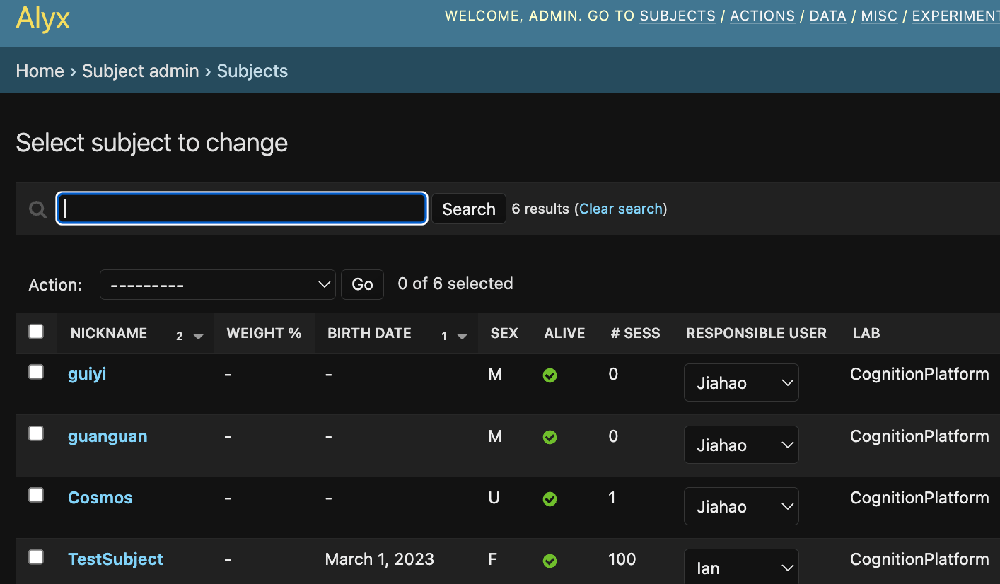
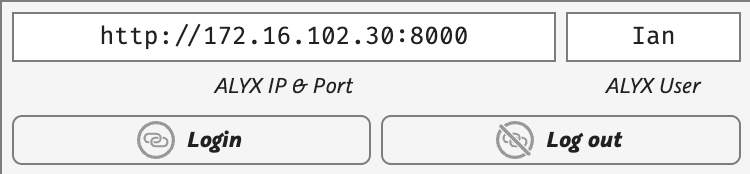
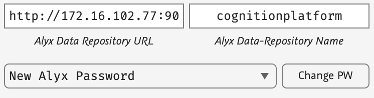
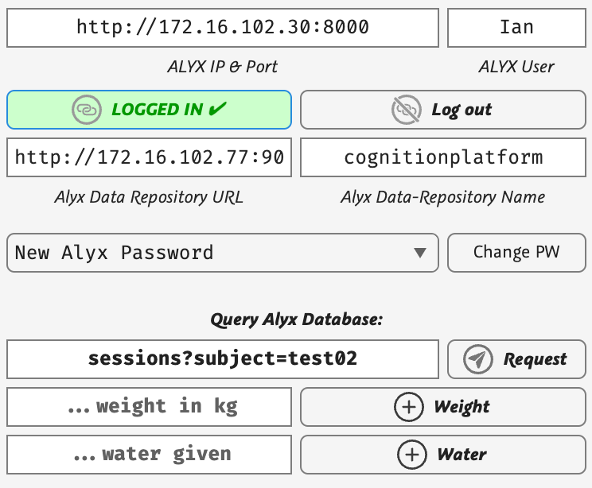
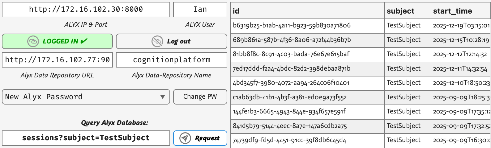
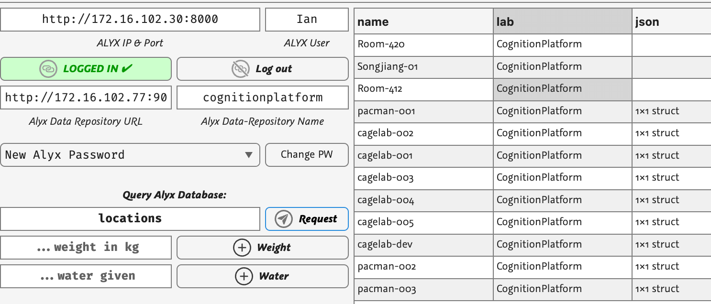
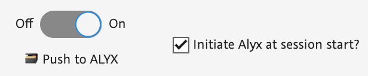
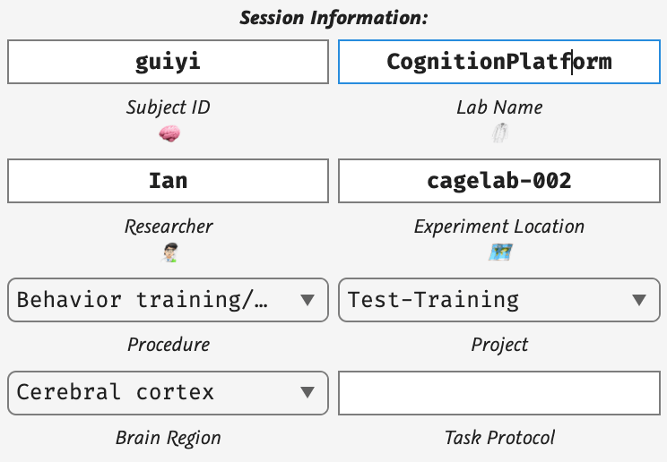
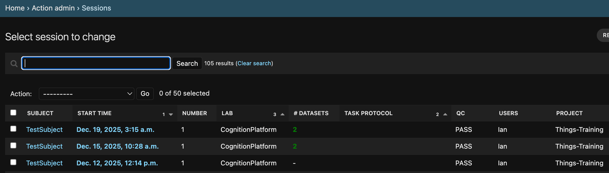

# How to Use Alyx with CageLab

Alyx is an experiment database made by International Brain Lab. While alyx is mostly focused on neuroscience tasks in mice, it can be generalised to other species as it supports generic JSON fields, and the core structure across species is more similar that the differences anyway. We use TWO componenets:

1) Alyx database — register subjects, labs, experimenters, projects and tasks; each time a session is run record the experiment metadata and link to the binary experiment files.
2) S3 data store ([Minio](https://minio.org) server) — copy raw binary and text experiment files saved by each session linked to the Alyx session metadata. Searching in Alyx can recover the files saved in the S3 data store.

In CageLab GUI there are two main interactions with Alyx:

1) Login and query settings in the database.
2) Setup session data and enable CageLAb to add the session to the database.

# Setting up the Database

> [!IMPORTANT] 
> You **MUST** ensure the Alyx database is setup with the core items you will use to run the session: `Subjects`, `Users`, `Labs`, `Locations`, `Projects`

Before running sessions, ensure that the items you will specify exist in the Alyx database, login to your Alyx (e.g. http://172.16.102.30:8000 ) and edit the database to add the Subjects, the Users (Researcher), the Lab, and the projects the tasks will be assigned to.

# CageLab: Logging in and running queries

CageLab allows you to enter your Alyx IP/port and user name and then login:

There is also a place to enter the Data repo IP and the data repo (bucket) name, and also to be able to edit the Alyx login password and data repo keys:

> [!TIP]
> These details are stored using MATLAB's `getSecret` and `setSecret` functions and are stored on the local, not remote machine. The remote machine can be set up with its own secrets or when a session runs the local secrets are sent to the remote system at runtime.

Once logged in you will see the query panel become active:

Note that you are logged in from your computer. This is nothing to do with a remote cagelab. By logging in it allows you to run Alyx database queries, for example `sessions?subject=TestSubject` will return all sessions recorded by Alyx for subject `TestSubject`:  

... or for example the lab locations where experiments are run:

A full list of all the queries you can perform is available from the Alyx database itself: http://172.16.102.30:8000/docs/ 

# CageLab: Running a Session

When you use CageLab GUI, turn ON push to Alyx. You can also "initiate" Alyx at session start so that Alyx logs a session once it initiates (otherwise it will only register after it is manually ended, thus a crash would not show in Alyx and data be lost).

Then ensure your Session data is accurate and consistent with what is in the database:

Subject, Lab, User and Location MUST already exist in Alyx or else it will crash. Procedure, Project, Brain Region should also be valid (they are populated after logging in to ensure they are valid). Task protocol is optional. 

When you run the task, Alyx will be initiated with a new Session, and when the session is stopped / ends, the MAT and LOG files will be uploaded to the S3 data server. You can check in the Sessions view:

You will see the session and can confirm that datasets were added. Note the data also remains in the same local SavedData folder, so it is available even if there is a database crash or other problem.