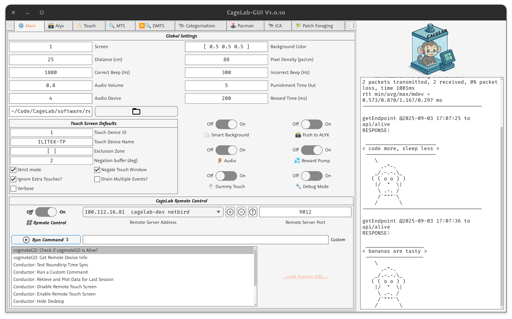

# User Guide for CageLab 

CageLab uses several core componenets to control and run remote neuroscience experiments, the cage-attached box is called **CageLab-Box** and the control computer **Control-PC**: 


For the enduser, the important ones are **Cogmote**, **CageLab-GUI** and **SSH**. These 3 tools allow you to control and view the remote system. You can also use **Sunshine**/**Moonlight** as a remote-desktop GUI if needed.

## Cogmote

...

## CageLab-GUI

CageLab-GUI is a MATLAB tool to create a set of control options that can be sent to run experiments via cogmoteGO. We use PTB and opticka to manage most experiments, sending a structure of options to CageLab tasks. One CageLaB-GUI can connect to many remote CageLab-Box devices.



## SSH Control

`ssh` allows you to login to the remote CageLab-Box and run commands and manage the system. You can also monitor the services that run on CageLab-Box. `ssh` uses private_public keys to ensure secure login. Each CageLab-Box has a public key, and the Control-PC has a private key stored in `~/.shh` that matches. To login you run the following command on the Control-PC:

```bash
ssh -i ~/.ssh/mykey cagelab@192.168.3.22.lab
```

You can simplify this by creating a `~/.ssh/config` file where you can specify the details for each system:

```conf
Host pacman-002
    Hostname 192.168.3.22
    User cagelab
    IdentityFile ~/.ssh/cagelab
	IdentitiesOnly yes
```

And now you can just type `ssh pacman-002` and the correct user and key will be used.  

All Linux commands are available. THe important commands involve managing the running services:

- `systemctl` - this manages services (`systemd` is the OS system that does this). For example to check the status of `cogmoteGO` you can run `systemctl --user status cogmoteGO`. To restart use the service: `systemctl --user restart cogmoteGO`
- `journalctl` - this command allows you to read the messages of a service. For example `journalctl --user --all -f -u theConductor` reads and follows the log for `theConductor`.


There are several zsh commands to help manage the remote system:

- `cagelab-reset` - restarts `cogmoteGO` and `theConductor`.
- `cagelab-monitor` - runs a CPU monitor, plus `journalctl` for both `cogmoteGO` and `theConductor` in 3 panel window. This uses a TMUX window (see below for the commands to control it).


### cagelab-monitor with tmux

You can remote view the logs of `cogmoteGO` and `theConductor` using `cagelab-monitor` once logged into ssh. This uses [tmux](https://github.com/tmux/tmux/wiki/Getting-Started) to divide the terminal window into 3 panes. You can enter a `tmux` control mode by pressing <kbd>ctrl</kbd><kbd>a</kbd>, then you can press <kbd>s</kbd> to show sessions. To exit the session press <kbd>x</kbd> and accept with <kbd>y</kbd>. You can open a new terminal in the session using <kbd>ctrl</kbd><kbd>a</kbd> then <kbd>-</kbd> or <kbd>ctrl</kbd><kbd>a</kbd> <kbd>|</kbd>. 